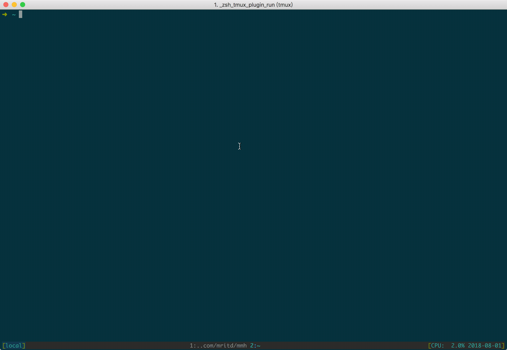
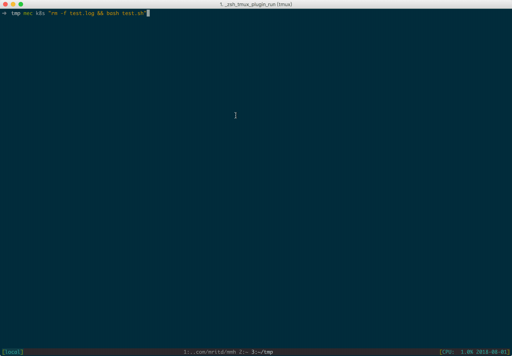
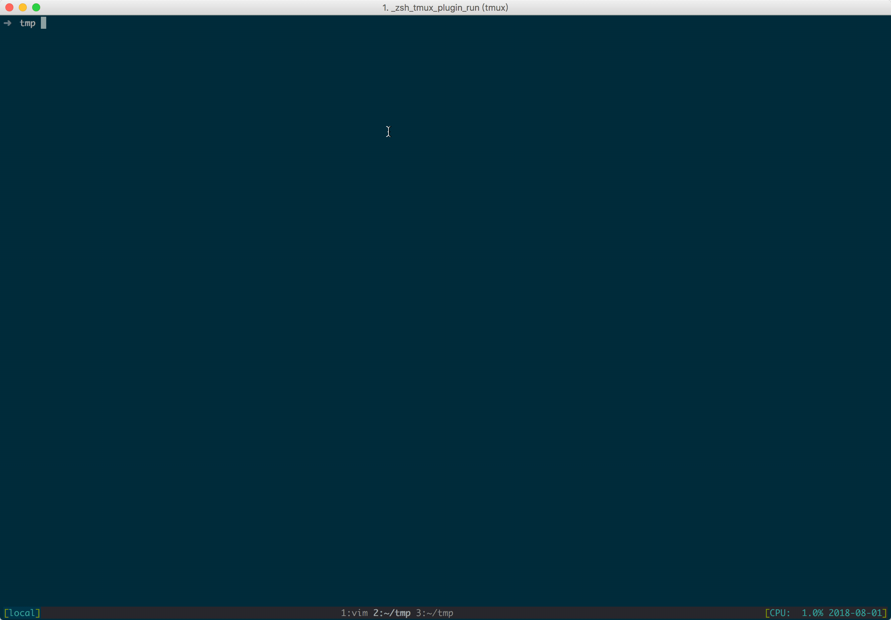

# mmh

> 一个使用 Go 编写的简单多服务器登录管理小工具.

### 安装

可直接从 [release](https://github.com/mritd/mmh/releases) 页下载预编译的二进制文件，然后执行 `sudo mmh install` 即可；
卸载直接执行 `sudo mmh uninstall`，卸载命令不会删除 `~/.mmh.yaml` 配置文件。

**默认安装到 `/usr/bin` 目录下，如果受权限限制无法安装，请使用 `--dir` 选项指定其他安装目录**

### 基本命令

```sh
➜  ~ mmh --help

A simple Multi-server ssh tool.

Usage:
  mmh [flags]
  mmh [command]

Available Commands:
  add         Add ssh server
  cp          Copies files between hosts on a network
  del         Delete ssh server
  exec        Batch exec command
  go          Login single server
  help        Help about any command
  install     Install mmh
  ls          List ssh server
  uninstall   Uninstall mmh
  version     Print version

Flags:
      --config string   config file (default is $HOME/.mmh.yaml)
  -h, --help            help for mmh

Use "mmh [command] --help" for more information about a command.
```

### 自动登录 

默认该工具在首次运行后将会创建 `$HOME/.mmh.yaml` 样例配置；配置中可以设置服务器地址、别名、登录方式等；样例配置如下:

```yaml
servers:
- name: d24
  tags:
  - doh
  user: root
  publickey: "/Users/mritd/.ssh/id_rsa"
  address: 172.16.0.24
  port: 22
  proxy: "d33"
- name: d33
  tags:
  - doh
  - k8s
  user: root
  password: "password"
  address: 172.16.0.33
  port: 22
tags:
  - doh
  - k8s
```

修改配置文件后可以使用 `mgo SERVER_NAME` 直接登录，如需交互式登录可执行 `mmh` 即可；其他相关命令如 `mmh ls/add/del` 
都与添加修改服务器配置相关，请自行尝试:



### 无限跳板

在每个服务器配置中可以设置一个 `proxy` 字段，当登录带有 `proxy` 字段的服务器时，工具会首先链接代理节点进行跳转；
这种能力方便于在使用跳板机的情况下无感的直连跳板机之后的主机；并且其支持无限的跳板登录，如 A、B、C 三台机器，
如果 C 的 `proxy` 设置为 B，同时 B 的 `proxy` 设置为 A，那么实际在登录 C 时，工具实际连接顺序为: `local->A->B->C`

**不要去尝试循环登录，比如 `A->B->C->A` 这种配置，工具内部已经做了检测防止产生这种 "真·无限跳板" 的情况，
默认最大跳板机数量被限制为 5 台，可通过在配置文件根节点中增加 `maxProxy` 字段进行调整**

### 管道式批量执行

在某些情况下可能需要对某些机器执行一些小命令，工具提供了 `mec` 命令用于批量执行命令:

```sh
➜  ~ mec --help

Batch exec command.

Usage:
  exec SERVER_TAG CMD [flags]

Aliases:
  exec, mec

Flags:
  -h, --help     help for exec
  -s, --single   Single server
```

在配置文件中每个服务器可以配置多个 tag，**`mec` 默认对给定的 tag 下所有机器执行命令**，如需对单个机器执行请使用 `-s` 选项；
**该命令目前支持管道处理和持续执行，比如批量执行 `tail -f` 命令等；除此之外还可以配合 grep 等命令进行自由发挥**:

**默认在批量执行模式下，每行输出前会加入当前服务器的名称前缀，在 `v1.1.0` 版本调整了颜色渲染代码，从而支持了前缀顺次颜色变换
(不会出现两个相邻服务器名字颜色一样的情况)；在单服务器下则每行输出不显示当前服务器前缀**



### 批量复制

为了尽量方便使用，模仿了一下 `scp` 命令，增加了批量复制功能 `mcp`；批量复制支持 **本地到远端多机器的文件/目录批量复制** 和
**单一远端机器到本地的文件/目录复制**；

```sh
➜  ~ mcp --help

Copies files between hosts on a network.

Usage:
  cp [-r] FILE/DIR|SERVER_TAG:PATH SERVER_NAME:PATH|FILE/DIR [flags]

Aliases:
  cp, mcp

Flags:
  -r, --dir      useless flag
  -h, --help     help for cp
  -s, --single   single server
```

**注意: 批量复制并不可靠，请谨慎使用；并非说代码不可靠，只是相对来说对于登录等功能，即使工具出问题，也很难造成灾难性后果；
但是复制功能是有能力造成文件覆盖的，从而造成灾难性后果；所以请谨慎使用，目前只针对常规情况作了大部分测试。**


